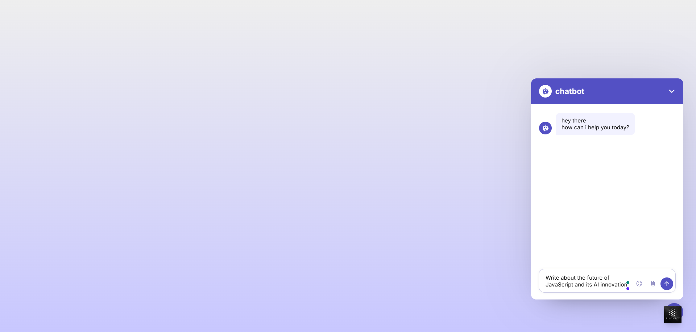
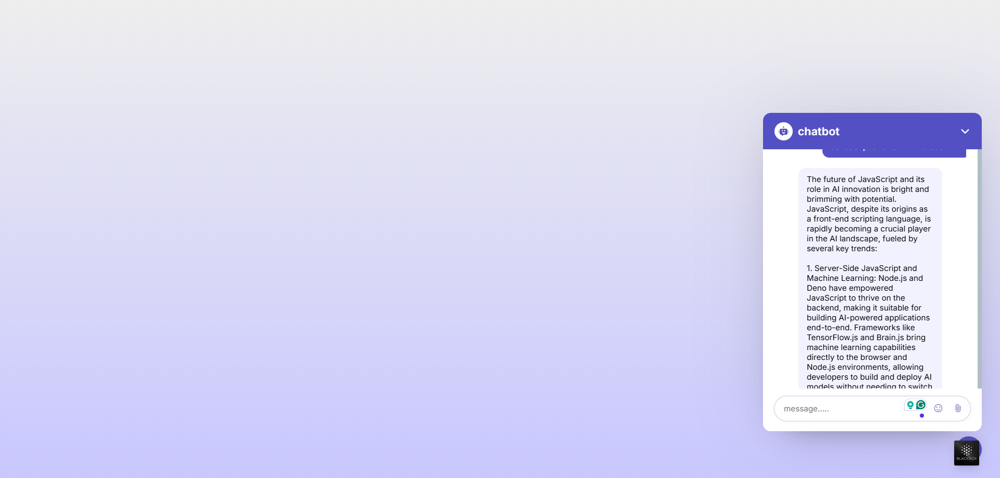

# AI-Chatbot-Application
A Normal AI chatbot application built using HTML, CSS, and JavaScript that leverages the Google Gemini AI API to generate intelligent responses. This project is designed to provide an interactive chat experience with no setup and a clean, responsive interface.

## Overview
This AI Chatbot Application is a lightweight web-based project demonstrating how to integrate the Google Gemini AI API with a front-end built in HTML, CSS, and JavaScript. It is perfect for learning how to connect to an AI service, handling API responses, and building a simple yet interactive user interface.

## Technologies Used

- HTML.
- CSS.
- JavaScript (No Additional Dependencies).
- Google Gemini AI API.

## Features

* Natural language conversations with AI.
* Clean and responsive user interface.
* Simple integration with Google Gemini API.
* Real-time message exchange.
* Search Anything, Question and Answers.
* Rewriting articles, Plagiarism Check.
* Code Generation, Suggestions, and Snippets.

## Installation

1. **Clone the Repository**

```bash
 git clone https://github.com/your-username/your-repo-name.git
```
2. **Navigate to the Project Directory**
```bash
 cd your-repo-name
```
3. **Open the Application**

Open the ```index.html``` file in your preferred web browser. No additional server or build step is required for this simple front-end project.

## Usage

1. **Launch the Application**
 
   Open ```index.html``` directly in your browser (or use a simple HTTP server if needed).

2. **Start Chatting**
   - Click the Right Bottom Corner of the Message Icon.
   - Type your message in the chat input box.
   - Press the Arrow Icon or Hit Enter Button.
   - The Chatbot will Process your Message Using the Google Gemini AI API and Display the Response.

## Screenshots





## Contributing
   Contributions are welcome! If you have suggestions, improvements, or bug fixes, please follow these steps:
   1. Fork the repository.
   2. Create a new branch for your feature or fix.
   3. Commit your changes and push to your branch.
   4. Open a pull request describing your changes.

   Please adhere to the existing code style and include relevant tests or documentation as needed.
